# Awesome Container Security Platform 🛡️

<p align="center">
  
</p>

<p align="center">
  <a href="https://github.com/ishandutta2007/Awesome-Awesome-Awesome"></a><a href="https://discord.gg/jc4xtF58Ve"></a>
  
  
  <a href="https://github.com/ishandutta2007"></a>
</p>

## 🚀 Top Container Security Platforms & Ecosystem

**Curated List of SaaS Products & Open-Source GitHub Projects**

*Focused on Container Image Scanning, Runtime Threat Detection, SBOM Generation, Kubernetes Security Posture Management (KSPM), Admission Control & Supply Chain Security.*

---

## 📊 Market Overview & Sector Insights

> 💡 **Estimated Market Size & Dynamics:**  
> The global Container Security Market size is estimated at **~$2.5 Billion in 2026** and is projected to reach over **$5.8 Billion by 2030** (growing at a CAGR of ~22%).  
> The sector is **moderately fragmented**, featuring established Cybersecurity giants (Palo Alto Networks, Tenable, SUSE) alongside specialized cloud-native category leaders (Sysdig, Aqua Security, Snyk, Chainguard) and a thriving open-source community driven by the Cloud Native Computing Foundation (CNCF).

---

## 📌 Table of Contents

- [🏢 SaaS/Hosted Platforms](#-saashosted-platforms)
- [🔓 Open-Source GitHub Projects](#-open-source-github-projects)
- [💡 Recommended Security Architecture](#-recommended-security-architecture)
- [🤝 How to Contribute](#-how-to-contribute)
- [💖 Support & Sponsorship](#-support--sponsorship)
- [📈 Star History](#-star-history)
- [⚠️ Disclaimer](#%EF%B8%8F-disclaimer)

---

## 🏢 SaaS/Hosted Platforms

| Platform 🚀 | Description 📝 | Market Size / Valuation / Revenue 💰 | Starting Pricing 🏷️ | Free Tier / Free Trial Limits 🎁 |
| :--- | :--- | :--- | :--- | :--- | | **[Prisma Cloud](https://www.paloaltonetworks.com/prisma/cloud)** | Palo Alto CNAPP with strong container & Kubernetes security modules across multi-cloud environments. | **$85B+ Market Cap** (Palo Alto Networks) | $90 / credit (~$300/host/yr) | 30-day free trial with full feature access |
| **[Tenable Cloud Security](https://www.tenable.com/)** | Cloud & container exposure management, vulnerability scanning, and agentless container posture. | **$6B+ Market Cap** / ~$850M Rev | $2,270 / year (Tenable.io baseline) | 30-day free trial (up to 16 IP assets) |
| **[JFrog Xray](https://jfrog.com/xray/)** | SCA & container registry scanning integrated into JFrog Artifactory software supply chain. | **$3.5B+ Market Cap** / ~$400M Rev | $99 / month (JFrog Pro Cloud) | Free tier: 2,000 build mins/mo & 20GB storage |
| **[Sysdig Secure](https://sysdig.com/)** | Cloud-native container runtime detection (Falco-based), image scanning & KSPM. | **$2.5B Valuation** / ~$150M ARR | $1.20 / node / day ($36/mo/node) | 30-day free trial (up to 50 nodes) |
| **[Aqua Security](https://www.aquasec.com/)** | Full-lifecycle container security, runtime protection, software supply chain controls & Trivy enterprise. | **$1.5B+ Valuation** | $0.85 / workload / day (~$25/mo) | 14-day free trial (full enterprise features) |
| **[Snyk Container](https://snyk.io/product/container-vulnerability-management/)** | Developer-first container vulnerability scanning with automated remediation PRs and CI/CD integration. | **$7.4B Valuation (Peak)** / $150M+ ARR | $25 / developer / month (Team plan) | **Free Forever**: 300 container scans / month |
| **[Chainguard](https://www.chainguard.dev/)** | Zero-known-vulnerability minimal base container images & supply chain security controls. | **$1.5B Valuation** | $99 / image / month (Chainguard Enforce) | **Free Forever**: Public developer images (apko/wolfi) |
| **[Anchore](https://anchore.com/)** | Enterprise container SBOM analysis, vulnerability management & supply chain security. | **$100M+ Raised** / ~$30M ARR | $15,000 / year (Enterprise base) | 15-day enterprise evaluation trial |
| **[Docker Scout](https://docker.com/products/docker-scout)** | Docker native image security insights, SBOM analysis, and supply chain policy checks. | **$2.1B Valuation** (Docker Inc.) | $17 / team member / month | **Free Forever**: 3 remote repos + unlimited local |
| **[StackRox / Red Hat ACS](https://www.redhat.com/en/technologies/cloud-computing/openshift/advanced-cluster-security-kubernetes)** | Kubernetes-native security platform for policy, vulnerability, and runtime protection on OpenShift. | **Part of IBM** ($180B+ Market Cap) | Included in OpenShift / $1,000/managed node/yr | 60-day self-managed evaluation license |
| **[NeuVector](https://www.neuvector.com/)** | Kubernetes-native container security with network visibility and deep packet inspection (SUSE). | **Part of SUSE** ($2B+ Enterprise Value) | $1,200 / node / year (SUSE subscription) | **Free Forever**: Full open-source core edition |
| **[Kubescape Cloud](https://kubescape.io/)** | SaaS posture dashboard, risk scoring, and compliance for Kubernetes clusters (ARMO). | **$30M+ Raised** (ARMO Security) | $6 / cluster node / month | **Free Forever**: Up to 10 cluster nodes |

---

## 🔓 Open-Source GitHub Projects

Below are top open-source projects for container security, image scanning, SBOM generation, and runtime protection, sorted by GitHub Star count 🌟.

- **[Trivy](https://github.com/aquasecurity/trivy)** [](https://github.com/aquasecurity/trivy/stargazers)  
  Comprehensive, all-in-one security scanner for container images, file systems, Git repos, Kubernetes, IaC, secrets, and SBOM (by Aqua Security).

- **[Falco](https://github.com/falcosecurity/falco)** [](https://github.com/falcosecurity/falco/stargazers)  
  CNCF Graduated runtime security threat detector for containers and Kubernetes using kernel eBPF tracepoints.

- **[cosign (Sigstore)](https://github.com/sigstore/cosign)** [](https://github.com/sigstore/cosign/stargazers)  
  Container image signing, verification, and software supply chain transparency (CNCF Sigstore project).

- **[OPA Gatekeeper](https://github.com/open-policy-agent/gatekeeper)** [](https://github.com/open-policy-agent/gatekeeper/stargazers)  
  Policy controller for Kubernetes enforcing CRD-based policies via Open Policy Agent (OPA).

- **[Kubescape](https://github.com/kubescape/kubescape)** [](https://github.com/kubescape/kubescape/stargazers)  
  CNCF sandbox Kubernetes security platform for posture management, risk analysis, compliance, and vulnerability scanning.

- **[Kyverno](https://github.com/kyverno/kyverno)** [](https://github.com/kyverno/kyverno/stargazers)  
  Kubernetes-native policy management tool designed specifically for admission control, image verification, and mutation.

- **[Syft](https://github.com/anchore/syft)** [](https://github.com/anchore/syft/stargazers)  
  CLI tool and library for generating Software Bills of Materials (SBOMs) from container images and filesystems (by Anchore).

- **[Grype](https://github.com/anchore/grype)** [](https://github.com/anchore/grype/stargazers)  
  Vulnerability scanner for container images and filesystems, natively supporting Syft SBOM inputs (by Anchore).

- **[Kube-Bench](https://github.com/aquasecurity/kube-bench)** [](https://github.com/aquasecurity/kube-bench/stargazers)  
  Checks whether Kubernetes is deployed securely by running checks documented in the CIS Kubernetes Benchmark.

- **[Clair](https://github.com/quay/clair)** [](https://github.com/quay/clair/stargazers)  
  Vulnerability static analysis service for OCI and Docker containers (maintained by Project Quay / Red Hat).

- **[Checkov](https://github.com/bridgecrewio/checkov)** [](https://github.com/bridgecrewio/checkov/stargazers)  
  Static code analysis tool for infrastructure-as-code (IaC) and container Dockerfiles (by Palo Alto Networks).

- **[Wolfi / apko](https://github.com/chainguard-dev/apko)** [](https://github.com/chainguard-dev/apko/stargazers)  
  Build tool for secure, minimal, distroless OCI container images from APK packages (by Chainguard).

- **[NeuVector Core](https://github.com/neuvector/neuvector)** [](https://github.com/neuvector/neuvector/stargazers)  
  Open-source container security platform with layer-7 network inspection, container firewall, and runtime defense.

---

## 💡 Recommended Security Architecture

```
 CI/CD Build Phase       Registry & Release         Kubernetes Cluster Runtime
 ------------------      ------------------         --------------------------
 🛠️ Dockerfile / Code  -->  📦 OCI Registry     -->   ☸️ K8s Cluster
    │                       │                       │
    ├── Scan: Trivy         ├── Sign: Cosign        ├── Admit: Kyverno / Gatekeeper
    └── SBOM: Syft          └── Verify: Grype       └── Detect: Falco eBPF
```

---

## 🤝 How to Contribute

1. Fork the repository 🍴
2. Create your feature branch (`git checkout -b feature/awesome-tool`)
3. Add your entry following the tabular format (for SaaS) or list format (for Open-Source).
4. Ensure factual links and clear concise summaries 📝
5. Submit a Pull Request! 🚀

---

## 💖 Support & Sponsorship

Thank you for exploring and supporting this curated container security ecosystem! 

If you find this list helpful, please consider:
- 🌟 **Starring** this repository on GitHub.
- 🔀 **Forking** and contributing new container security projects.
- 📢 **Sharing** this resource with your DevOps, DevSecOps, and Cloud Security peers.
- ☕ **Sponsoring** the maintainer via [GitHub Sponsors](https://github.com/sponsors/ishandutta2007).

---

## 📈 Star History

[](https://star-history.dera.page/#ishandutta2007/Awesome-Container-Security-Platform&type=date&legend=top-left)

---

## ⚠️ Disclaimer

- This repository is a community-curated collection for educational and informational purposes.
- Mentions of products do not constitute an endorsement.
- Container security requires end-to-end defense-in-depth configuration. Always evaluate tools according to your organization's specific compliance and security requirements.

---

<p align="center">
  <b>Made with ❤️ for platform engineers, security researchers, and DevSecOps professionals worldwide.</b>
</p>
